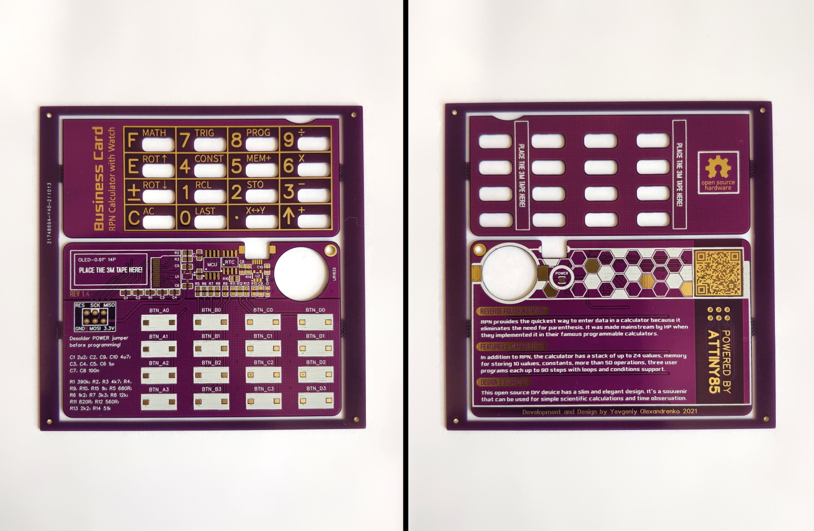
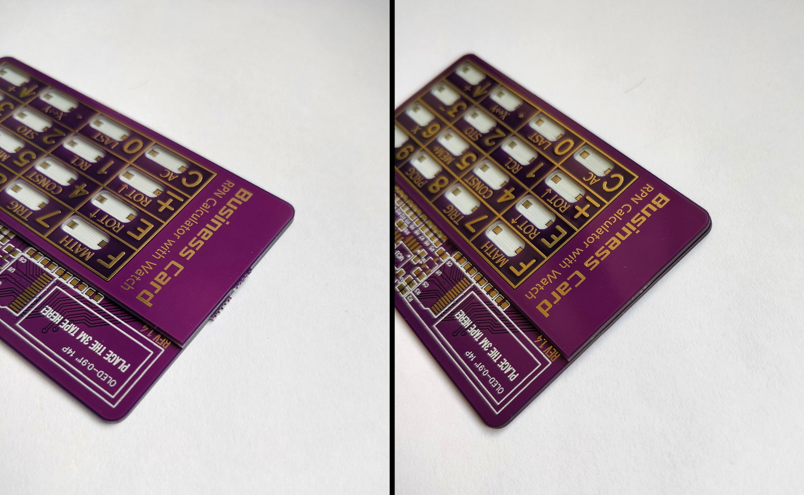
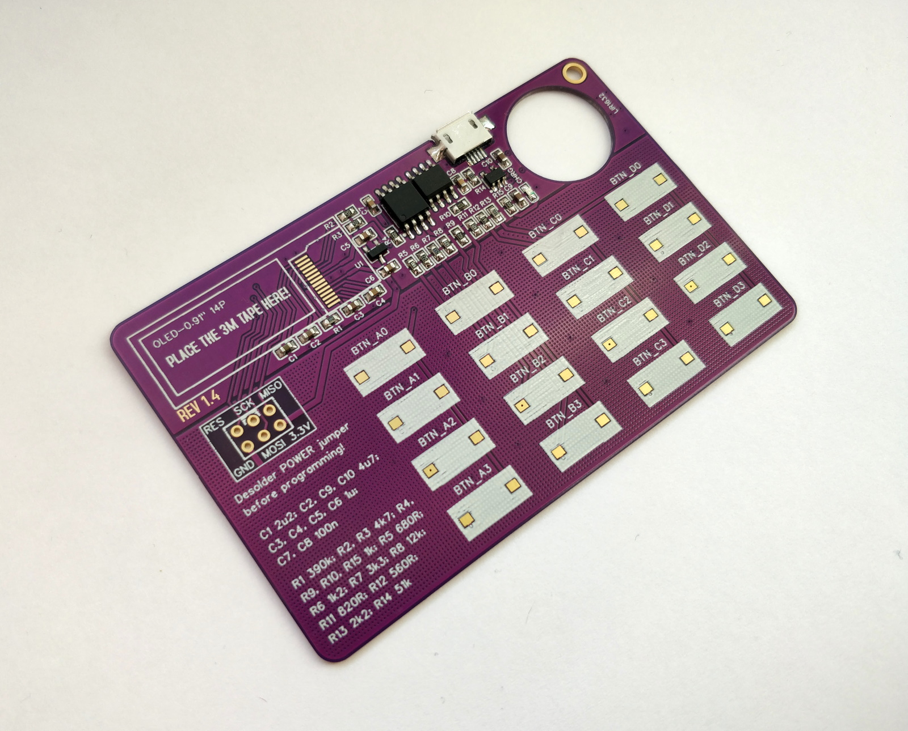
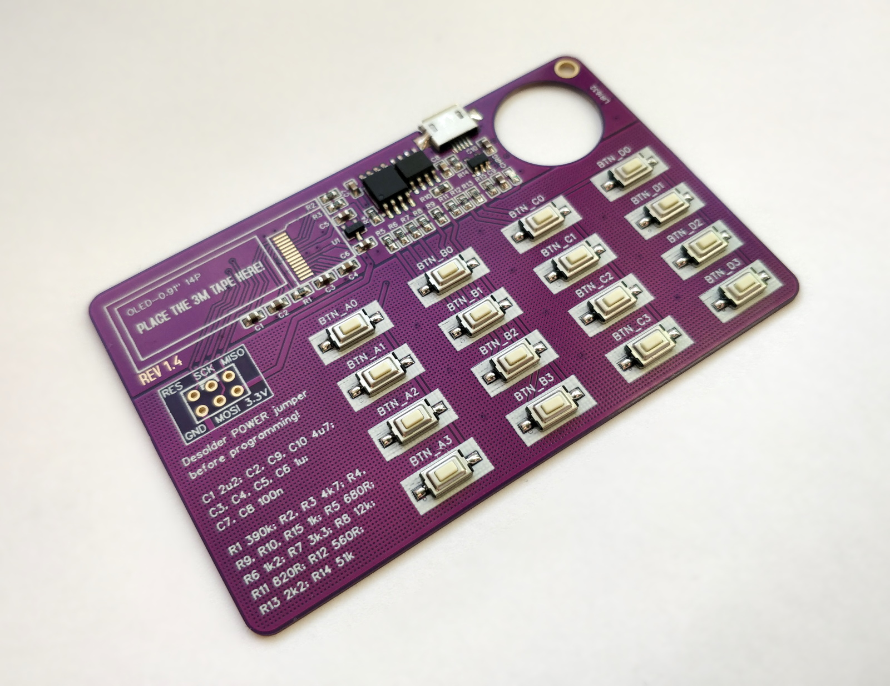
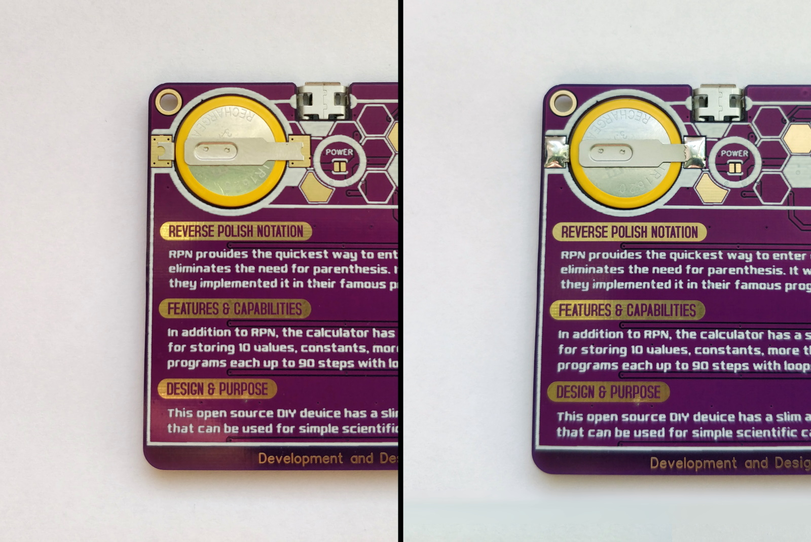
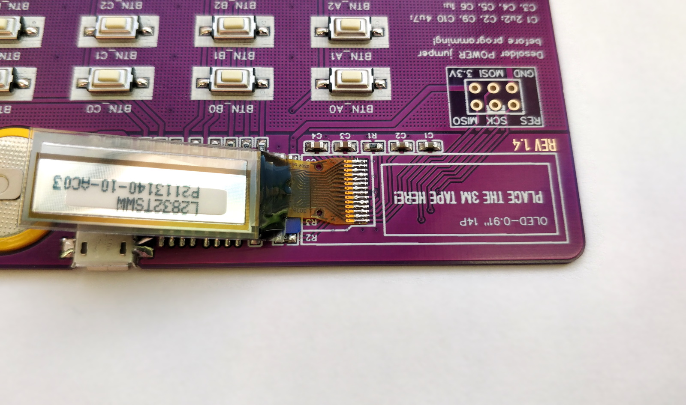
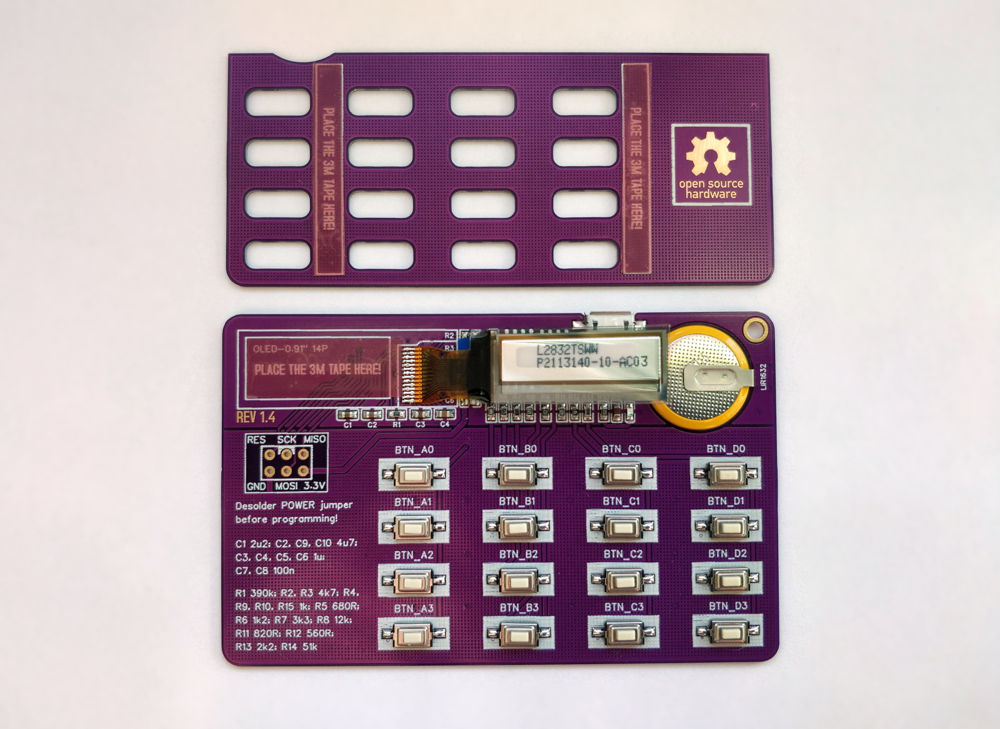
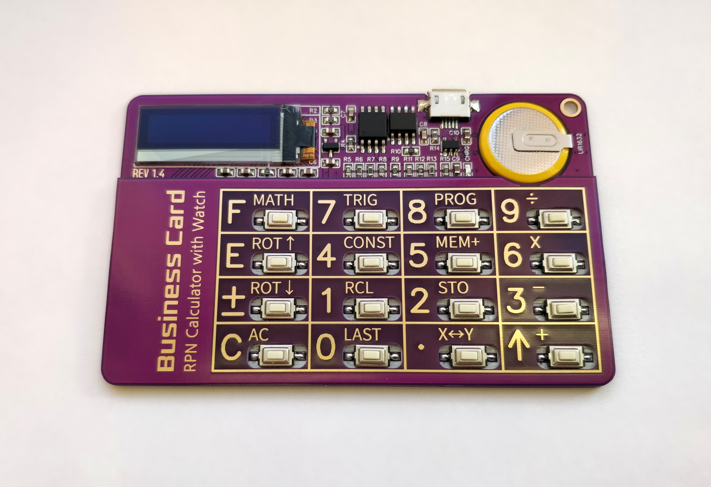

# How to build the calculator

### Step 1 - TODO

### Step 2 - TODO

### Step 3 - SMD Components

### Step 4 - Buttons

### Step 5 - Battery

### Step 6 - Display

### Step 7 - Ultra-thin 3M tape

### Step 8 - Programming

TODO

### Step 9 - Finished Device

